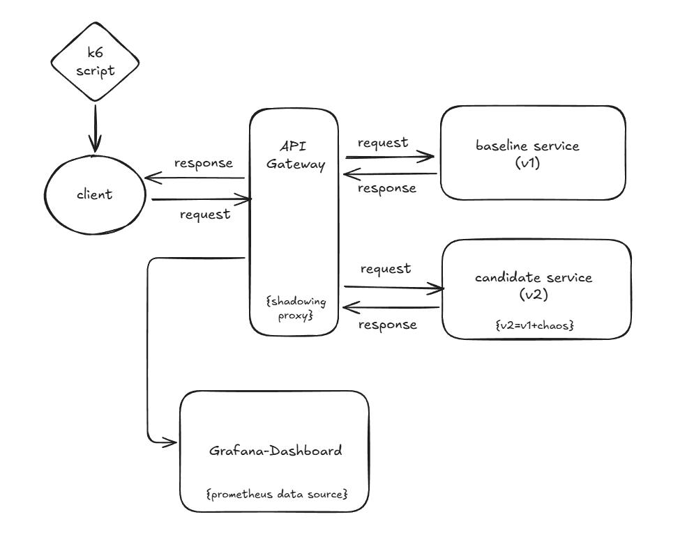

# MirrorLab – Traffic Shadowing Proxy

MirrorLab is a small end-to-end demo of **safe releases**:

- A **Go** proxy/API gateway that:
  - Forwards real requests to a **baseline** service.
  - Silently **mirrors** a sample of traffic to a **candidate** service.
  - Compares responses and latency.
  - Automatically **disables mirroring** when the candidate behaves badly.
- Two **Java (Spring Boot)** services:
  - `service-v1` – baseline (no chaos).
  - `service-v2` – candidate (configurable latency and error injection).
- **Prometheus + Grafana** dashboards to visualize RPS, latency, errors, diffs, and guardrail behaviour.

You can use this project to show experience with:

- Safe rollout patterns (traffic shadowing / dark launching).
- SLO-style thinking and guardrails.
- Go, Java 21, containerization, and observability.

---

## Architecture

High-level flow:

1. Clients send traffic to the Go **proxy**.
2. Proxy forwards the request to **baseline (v1)** and returns that response to the caller.
3. Proxy optionally **mirrors** the same request to **candidate (v2)** in the background.
4. Proxy compares baseline vs candidate responses, tracks latency and errors, and updates metrics.
5. If the candidate is consistently too slow or error-prone, the guardrail **switches off mirroring**.
6. Prometheus scrapes metrics from the proxy and both services; Grafana visualizes them.




---

## Features

- **Non-blocking traffic mirroring**
  - User response always comes from the baseline service.
  - Mirroring to candidate is asynchronous and sampled by `MIRROR_FRACTION`.

- **Response comparison with PII masking**
  - JSON responses from baseline and candidate are:
    - Parsed and normalized.
    - Certain keys ignored (timestamps, trace IDs, request IDs).
    - Simple PII-like fields (email, phone, name, cc_last4) masked.
  - Structural differences are counted as mismatches per route.

- **Latency and error guardrail**
  - For each mirrored request, the proxy records:
    - Baseline vs candidate latency.
    - Baseline vs candidate error outcome.
  - If the candidate is consistently slower or more error-prone for several requests in a row:
    - Mirroring is disabled (guardrail “abort”).
    - A metric and status are updated.
    - Mirroring can automatically re-enable after a cooldown or manually via an API.

- **Observability**
  - Proxy exposes Prometheus metrics (requests, latency histograms, diff mismatches, guardrail state).
  - Java services expose Micrometer/Prometheus metrics via `/actuator/prometheus`.
  - Prometheus scrapes all three.
  - Grafana dashboard shows:
    - RPS (baseline vs candidate).
    - p50/p90/p99 latency per target.
    - Error rate per service.
    - Diff mismatch rate.
    - Mirroring state (on/off) and abort count.

---

## Tech stack

- **Proxy / Gateway**
  - Go (tested with Go 1.25.4)
  - `net/http`
  - `github.com/prometheus/client_golang`

- **Demo services**
  - Java 21
  - Spring Boot 3.x (Web + Actuator)
  - Micrometer + Prometheus

- **Observability**
  - Prometheus
  - Grafana

- **Container / Orchestration**
  - Docker
  - Docker Compose

---

## Getting started

### Prerequisites

- Docker
- Docker Compose
- For local development (optional):
  - Go 1.25+ (proxy)
  - JDK 21 (Java service)

### Clone and run

```bash
git clone <your-repo-url>
cd <your-repo-folder>

# build and start proxy, services, Prometheus, Grafana
docker compose up --build
```

Once everything is healthy:

- Proxy: `http://localhost:8080`
- Baseline (direct): `http://localhost:4001`
- Candidate (direct): `http://localhost:4002`
- Prometheus UI: `http://localhost:9090`
- Grafana UI: `http://localhost:3000` (default admin/admin unless changed)

---

## Configuration

### Proxy (Go)

Configured via environment variables (in `compose.yaml`):

- `BASELINE_URL` – URL for baseline service (default `http://service-v1:4001`)
- `CANDIDATE_URL` – URL for candidate service (default `http://service-v2:4002`)
- `MIRROR_FRACTION` – fraction of requests to mirror (e.g. `0.25` for 25%)
- `LISTEN_ADDR` – listen address (default `:8080`)

Guardrail:

- `ABORT_P99_RATIO` – latency ratio threshold (approximate)  
  If candidate latency is consistently worse than `ABORT_P99_RATIO * baseline`, it counts as a breach.
- `ABORT_ERROR_DELTA` – error “delta” threshold (simplified)  
  If candidate has errors while baseline does not, it counts toward breaches.
- `ABORT_CONSECUTIVE` – number of consecutive breaches required to disable mirroring.
- `ABORT_COOLDOWN` – cooldown in seconds before auto-re-enabling mirroring.

Control endpoints (proxy):

- `GET /healthz` – health check.
- `GET /metrics` – Prometheus metrics.
- `GET /control/status` – JSON guardrail status.
- `POST /control/enable` – manually re-enable mirroring.
- `POST /control/disable` – manually disable mirroring.

### Java services (Spring Boot)

Both v1 and v2 run from the same jar/container, configured by env:

- `SERVICE_NAME` – label for metrics (`service-v1`, `service-v2`).
- `PORT` – service port (baseline: `4001`, candidate: `4002`).
- `CHAOS_LATENCY_MS` – base latency injected in every request for that instance.
- `CHAOS_JITTER_MS` – extra random latency in `[0, CHAOS_JITTER_MS]`.
- `CHAOS_ERROR_RATE` – probability of returning an injected 500 (e.g. `0.02` = 2% errors).

Actuator / Prometheus:

- Metrics exposed at: `/actuator/prometheus`
- HTTP metrics include latency histograms and outcomes per service.

---

## Endpoints

### Through the proxy (preferred for demos)

- `GET /api/search?q=<term>` – search products.
- `GET /api/product/{id}` – fetch a single product.
- `POST /api/checkout` – submit a checkout (body includes product IDs and email).

Example:

```bash
curl "http://localhost:8080/api/search?q=ssd"

curl "http://localhost:8080/api/product/p-100"

curl -X POST "http://localhost:8080/api/checkout" \
  -H 'content-type: application/json' \
  -d '{"productIds":["p-100","p-104"],"email":"demo@example.com"}'
```

### Direct (debugging)

- Baseline: `http://localhost:4001/api/...`
- Candidate: `http://localhost:4002/api/...`

Metrics:

- Proxy: `http://localhost:8080/metrics`
- v1: `http://localhost:4001/actuator/prometheus`
- v2: `http://localhost:4002/actuator/prometheus`

---

## Demo script (/hide)

This is the flow you can use in interviews or a screencast.

1. **Start everything**

   - `docker compose up --build`
   - Open Grafana → point it to Prometheus at `http://prometheus:9090`.

2. **Baseline run (healthy candidate)**

   - Run with candidate chaos off (e.g. `CHAOS_LATENCY_MS=0`, `CHAOS_ERROR_RATE=0.0`).
   - Generate some traffic through the proxy:
     
     - Manually with `curl`, or
     - With a load tool like k6 (optional; see below).
   - Show in Grafana:
     - RPS for baseline and candidate.
     - p99 latency lines roughly aligned.
     - Error rates near zero.
     - `mirror_enabled = 1`, `mirror_aborts_total = 0`.

3. **Introduce a regression in v2**

   - Edit `compose.yaml` (or env) so candidate has:
     - `CHAOS_LATENCY_MS=200`
     - `CHAOS_ERROR_RATE=0.02`
   - Restart candidate (and proxy if needed).
   - Generate load again.
   - Show in Grafana:
     - Candidate p99 rising above baseline.
     - Candidate error rate climbing.
     - Diff mismatches increasing.
     - After enough bad requests, mirroring is disabled:
       - `mirror_enabled` drops to 0.
       - `mirror_aborts_total` increments.

4. **Recovery**

   - Restore candidate’s settings to healthy values.
   - Re-enable mirroring via `POST /control/enable` or after cooldown.
   - Show metrics stabilizing and mirroring back at 1.

---

## Prometheus metrics

From the proxy:

- `mirror_requests_total{route, target}`  
  Number of proxied/mirrored requests per route and target (`baseline`/`candidate`).

- `mirror_latency_seconds_bucket{route, target, le}`  
  Histogram buckets of upstream latency; used for p50/p90/p99 with `histogram_quantile`.

- `mirror_diff_mismatches_total{route}`  
  Count of response mismatches after JSON normalization and PII masking.

- `mirror_enabled`  
  Gauge: `1` if mirroring is currently allowed, `0` if disabled.

- `mirror_aborts_total`  
  Count of guardrail-triggered mirroring aborts.

From the Java services (Micrometer):

- `http_server_requests_seconds_count{service, outcome, ...}`  
  HTTP request counts per service (used for error rate).

- `http_server_requests_seconds_bucket{service, ...}`  
  Latency histogram buckets per service.

These support Grafana panels for RPS, error rate, and latency.

---

## Repository layout

```text
mirrorlab/
    ├── .mvn/
    ├── docs/
    ├── observability/
    │   └── prometheus.yml
    ├── proxy/
    │   ├── main.go
    │   ├── config.go
    │   ├── metrics.go
    │   ├── guardrail.go
    │   ├── diff.go
    │   └── proxy_handler.go
    ├── src/
    │   └── ... (v1-v2 service)
    ├── target/
    ├── .gitattributes
    ├── .gitignore
    ├── compose.yaml
    ├── Dockerfile
    ├── HELP.md
    ├── mvnw
    ├── mvnw.cmd
    └── pom.xml
    └── README.md
```
